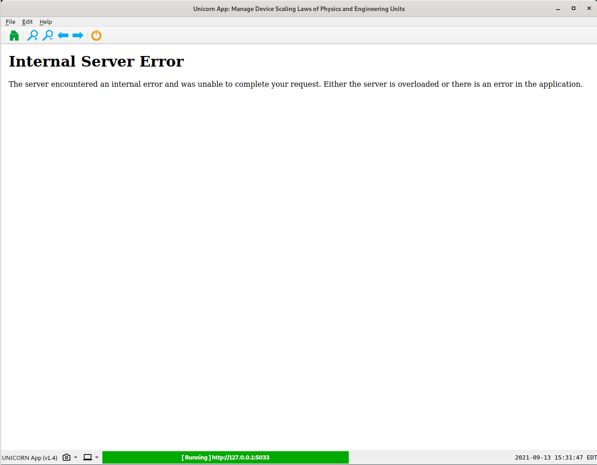
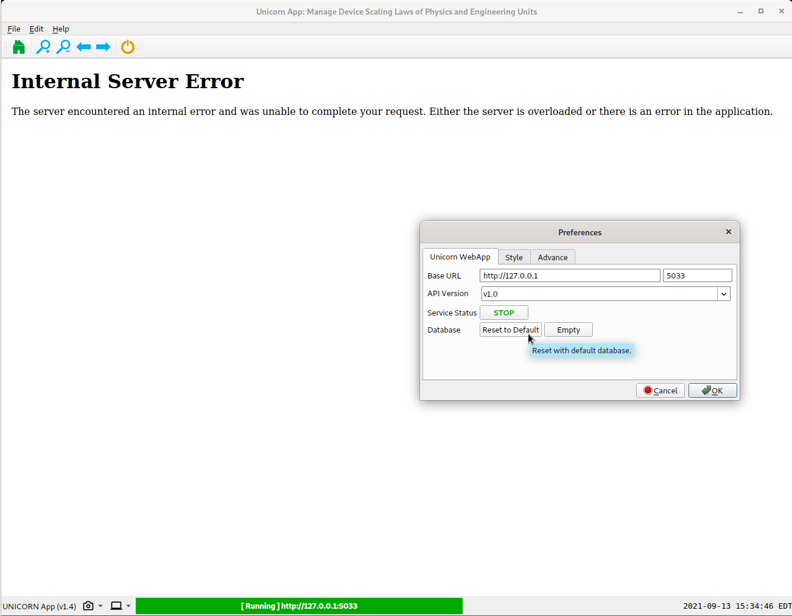
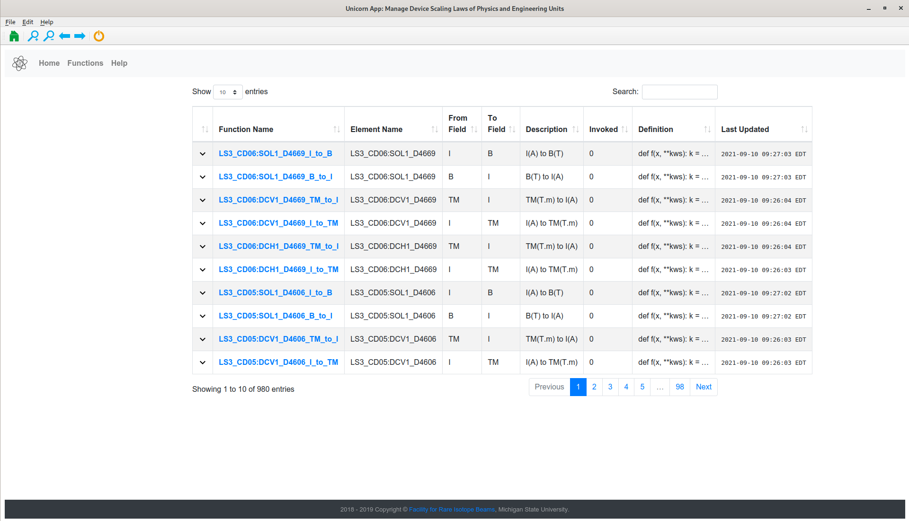
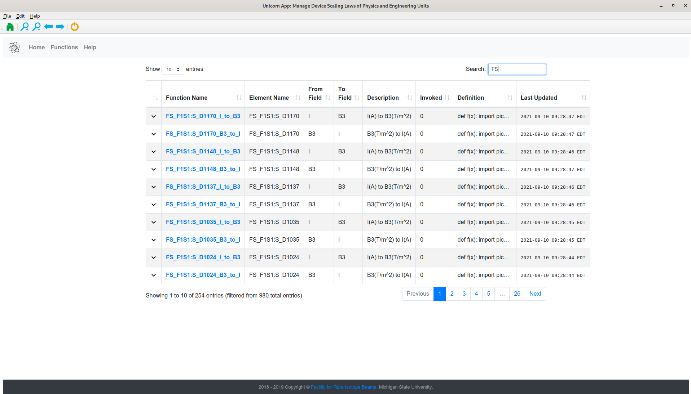
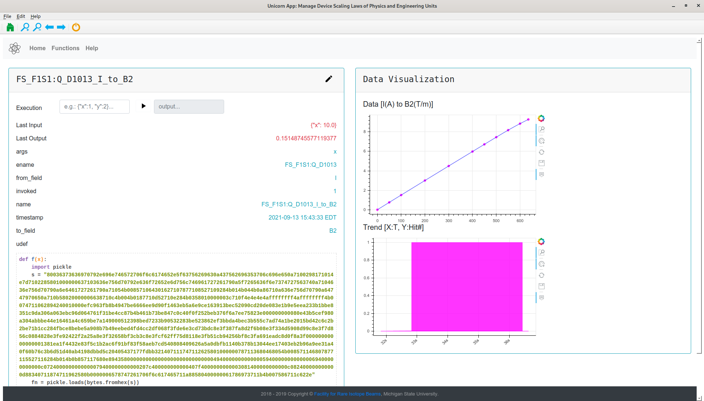
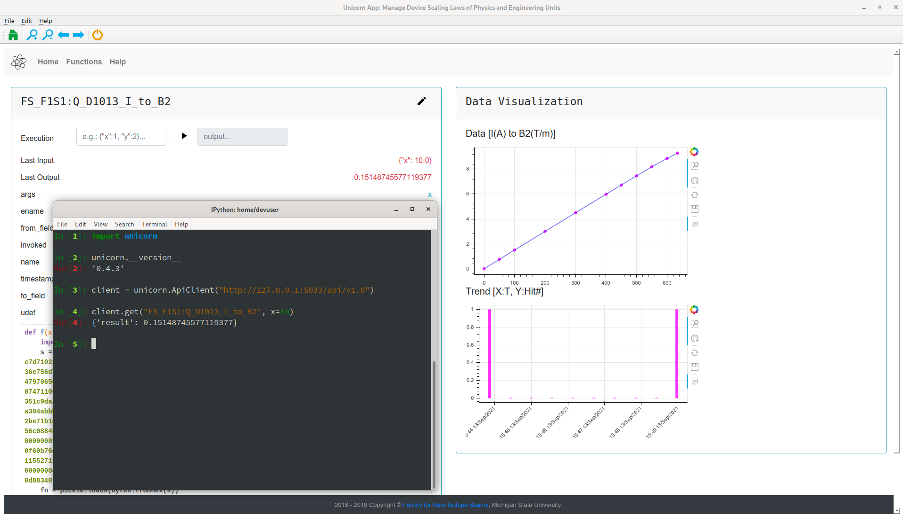
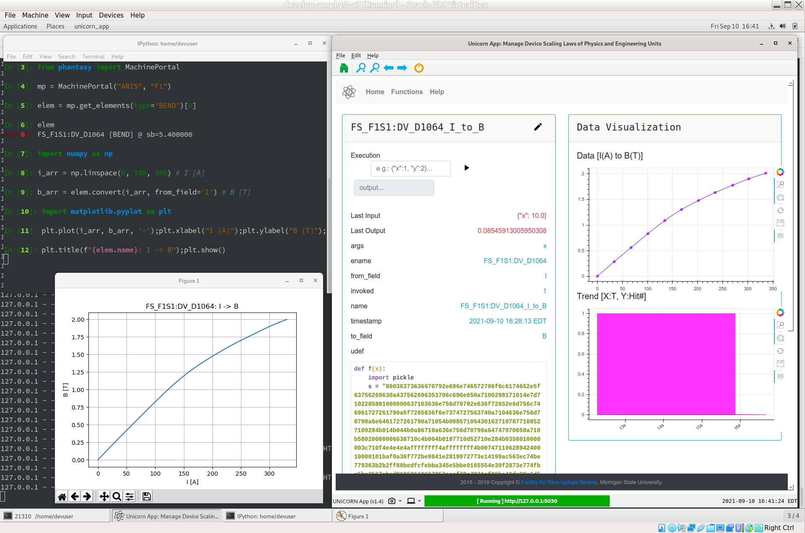

.. _un-ref-label:

=======================
Quantity Interpretation
=======================

This page explains how the physics quantity in terms of
*unit* is managed in the high-level physics controls.

Usually, the device is controlled by applying proper voltage or
current, which the value set out from the control variable (or Process
Variable in EPICS) is in the unit of *Voltage* [A] or *Ampere* [A]
(which is indicated in the EGU channel).

From the physics modeling perspective, it is always expecting that the
values are presented in the way that modeling tools can directly use them,
that is interpreting the EGU values in other *units*, e.g. interpreting
current in Ampere to a magnetic field in Tesla for dipole, current to a
magnetic gradient in T/m for quadrupole, etc., and vice-versa.

Considering the use-cases of interpreting the EGU to various physics units,
the software design for the data management is split into three parts:

* Dedicated web app to present and serve the data.
* Dedicated Python client to retrieve the data.
* PHANTASY libraries to intergrate the data for easy access.

As such, three different projects are created:

* *unicorn-webapp*: a web application could be started with ``unicorn_app``
  command, which is provided by ``phantasy-apps``.
* *unicorn*: a Python package for data communication with ``unicorn-webapp``.
* APIs bound with ``CaElement`` of PHANTASY for easy access to these data.

UNICORN Web App
---------------

First off, install ``unicorn-webapp`` via apt-get: ``sudo apt update && sudo apt install unicorn-webapp``.
The way to start up UNICORN web app is executing command ``unicorn_app``
in Terminal. You may get the "Internal Server Error" shown as below:

Which could be fixed by Edit -> Preferences -> Database -> Reset to Default.

You'll see the page for *functions* (click **Functions** tab), each one is named with *Device name*_*field-1*_to_*field-2*,
to interpret the value in the unit of *field-1* to the value for *field-2*.

In the search box, type *FS* to list only pre-separator devices.

Clicking each function name will direct you to the data page, e.g. the screenshot
below shows the I/B2 relation for FS_F1S1:Q_D1013 device, *Execution* line supports simple
value calculation.

Python UNICORN
--------------
Once the unicorn-webapp is running, there's another way to get data in Python terminal, by using
``unicorn`` package.

See more details on *Help* tab of unicorn web app for Python API usage.

PHANTASY Integration
--------------------
As one can see, the above sections solve the units issue for the data value interpretation
in different use-cases. For even easier and robust access to all these data,
dedicated libraries have been developed to integrate this info into *phantasy*.

In this scenario, no unicorn web app is needed to run in the background, all the data is served by
proper configuration keys.

The screenshot below shows how to convert the input field to another, e.g. I to B, one can access
*I* and *B* through dot syntax, i.e. ``elem.I`` and ``elem.B``, either one will return the current
readback of the device in terms of the current or magnetic field. *.convert()* function does only
calculation, no real device controls are involved. ``elem.I = <new I>`` or ``elem.B = <new B>``
will set the device to the desired value in terms of the field which is being worked on.

